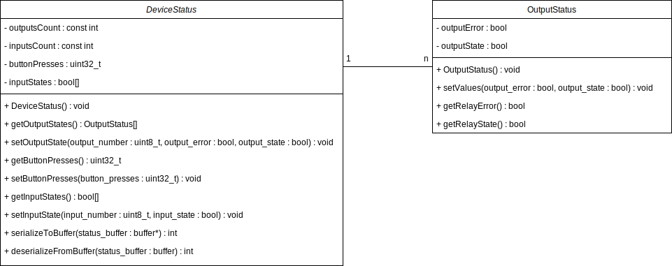
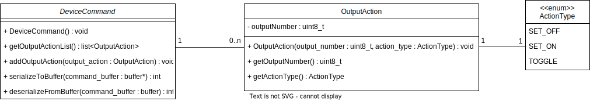

# IO Module documentation

This is the documentation which describes IO module and module's devices.

## Module proposal

### Device

Devices supported by this module include these components:
 - inputs
 - outputs
 - button

Every device can have any number of these components, except for button, only one is allowed.

### Messages

#### Status

Status messages contain this information about components:
 - array of inputs (the number of inputs on device determines array size)
    - number of input
    - state of input (true when input is high, else false)
 - array of outputs (the number of outputs on device determines array size)
    - number of output
    - bool value, which determines if error occurred on output
    - state of output (true when output is high, else false)
 - button
    - number of presses

When Status is generated on any device, the input and output states are measured and directly written into Status. If a device has a button, the presses of the button are counted between Statuses and are included into Status.

> Status implementation is generic. That means that the number of inputs and outputs is modifiable. This is achieved by using a C++ template (DeviceStatus class is the template).

##### Class diagram



#### Command

Command messages contain:
 - list of outputAction messages, every outputAction message contains:
   - number of output, which this action will affect
   - ActionType enumeration, which could be SET_ON, SET_OFF, TOGGLE

For every command action in Command, the action is executed on specified output. The SET_ON action sets the output on, the SET_OFF sets it of and TOGGLE change the output state to negation of current state.

##### Class diagram



#### JSON messages

Statuses and commands decribed above will be transported as JSON strings. The key names are shortened to save some space on devices with limited memory.

##### Example of status JSON

```json
[
    [
        { "inNum": 1, "inSt": false },
        { "inNum": 2, "inSt": false },
        { "inNum": 3, "inSt": true },
        { "inNum": 4, "inSt": false },
        { "inNum": 5, "inSt": true },
        { "inNum": 6, "inSt": false }
    ]
    [
        { "outNum": 1, "outErr": false, "outSt": false },
        { "outNum": 2, "outErr": false, "outSt": true },
        { "outNum": 3, "outErr": false, "outSt": true },
        { "outNum": 4, "outErr": false, "outSt": false },
    ],
    { "butPr": 2 },
]
```

> The count of inputs and outputs is based on available components on the Device.

##### Example of command JSON

```json
[
    {"outNum": 1, "actType": 1},
    {"outNum": 2, "actType": 1},
    {"outNum": 3, "actType": 2}
]
```

## Devices

 - All devices use Pull-up resistors on inputs. This means that when nothing is connected to input, it is set to HIGH.
 - The size of the incoming command is restricted on all devices (The size is different based on a device's available memory)

### Arduino Opta

#### Device specs
 - input count : 6
 - output count: 4
 - one button
 - 4 LEDs - on device they are turned on to indicate that output is set
 - max command size: 1024 bytes

#### Status forwarding

The Fleet protocol allows definition of conditions, when the Status will be forwarded to external app. For more information, read the Fleet protocol documentation.

Status will be forwarded to the external app when:
 - there is a difference between the previous and current status (e.g. output has been turned on; state of any input has changed)
 - buttonPresses in Status is higher than 0 or buttonPresses is 0 and buttonPresses in previous status was higher than 0.

### Arduino Mega R3 (deprecated)

 **This device was deprecated because of its small memory and limited usage.**

#### Device specs
 - input count : 4
 - output count: 4
 - no button (buttonPresses always 0)
 - max command size: 200 bytes

 > On Arduino Mega there are 16 available inputs and outputs both, but there is a problem with memory on Arduino Mega when using JSON statuses with all of these values. So only 4 inputs and 4 outputs are used at the moment.
 To use all of the Mega's components, the memory problem must be resolved (with for example shortening the json - boolean->number; shorter key strings).

#### Status forwarding

Status will be forwarded to the external app when:
 - there is a difference between the previous and current status (e.g. output has been turned on; state of any input has changed)

### Arduino Uno R4 Minima

 > The implementation relies on using Arduino Uno R4 due to its bigger memory. Using the R3 revision or lower may not work.

#### Device specs
 - input count : 6
 - output count: 7
 - no button (buttonPresses always 0)
 - max command size: 1024 bytes

 > Some pins are not used, because they are used by something else (pins: 4, 10, 11, 12, 13 used by Arduino ethernet shield, pins: 0, 1 used by UART).

#### Status forwarding

Status will be forwarded to the external app when:
 - there is a difference between the previous and current status (e.g. output has been turned on; state of any input has changed)

### Button

Simple general button representation. The input is true when button is not pressed and false when button is pressed.

#### Device specs
 - input count : 1
 - output count: 0
 - no button (buttonPresses always 0) - button functionality is forwarded via input

#### Status forwarding

Status will be forwarded to the external app when:
 - there is a difference between the previous and current status (e.g. output has been turned on; state of any input has changed)

## Behaviour in External server

The IO module in External server uses [this HTTP Api](https://github.com/bringauto/fleet-http-client) to communicate with some external app. The statuses are sent to the external app and the commands are received from it. The HTTP Api connection credentials must be forwarded to IO module config. The credentials in External server's config could look like this:

```json
{
    // ...
    "config": {
        "api_url": "...",
        "api_key": "...",
        "max_requests_threshold_count": "10",
        "max_requests_threshold_period_ms": "5000",
        "delay_after_threshold_reached_ms": "5000",
        "retry_requests_delay_ms": "200"
    }
    // ...
}
```
 